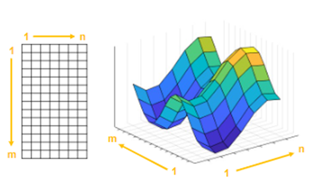
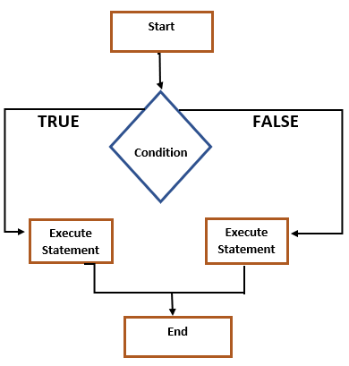
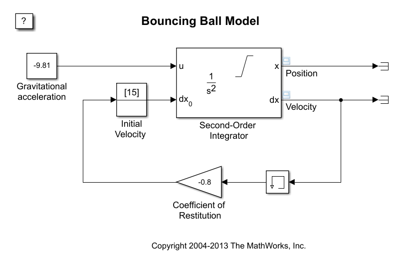
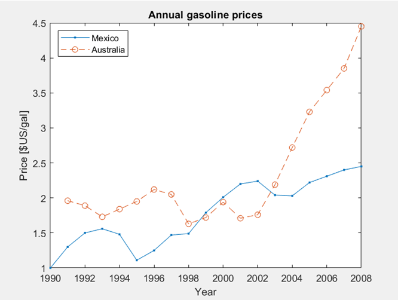
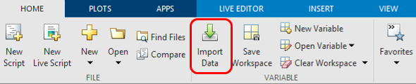
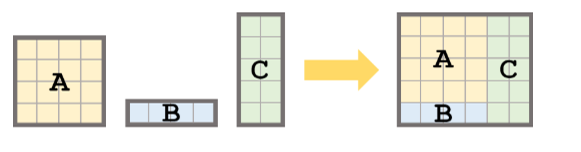
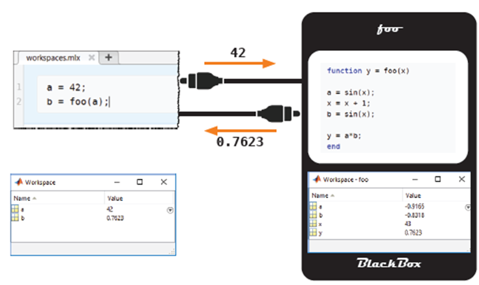
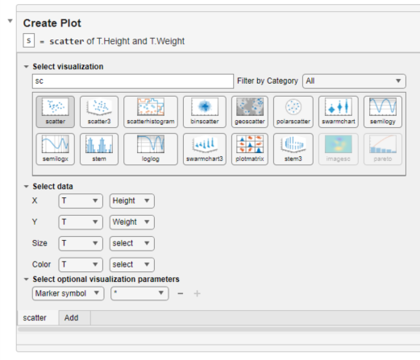

# Introduction-to-Programming-in-MATLAB

## Curriculum Module

_Created with MATLAB R2022a. Compatible with MATLAB R2022a and later releases._

2023 © John Ekoru ([University of the Witwatersrand](https://www.wits.ac.za), [Academic Development Unit, Faculty of Engineering and the Built Environment](https://www.wits.ac.za/ebe/teaching-and-learning/))

## Description of content

This teaching package contains content for the course “Introduction to Programming in MATLAB”, consisting of the following:
1. A set of MATLAB [Live Scripts](https://www.mathworks.com/products/matlab/live-editor.html) arranged by topic, to be completed over a 6-week period.
2. A set of complementary PowerPoint presentations.

The content of this package is targeted towards both undergraduate and postgraduate students who are first time/novice programmers. MATLAB is a programming and numeric computing platform developed by MathWorks. 

The intention of this package is to gradually introduce students to the basics of Programming in an accessible manner, providing both theoretical underpinning along with guided demonstration and practical exercises. This is made possible making use of MATLAB Live Scripts which incorporate text, visual aids as well as links to videos and other multimedia instructional content.

It is expected that students who complete this course will have been provided a sufficient foundation to delve into areas requiring intermediary and advanced programming skills using MATLAB including such as Machine Learning, Shallow Neural Networks, Deep Learning etc.

## Some Learning Highlights

|  Learn to plot multidimensional data |   Understand control flow structures in MATLAB |   Simulate dynamic models in MATLAB Simulink |
| ----------- | ----------- | ----------- |

|  Create Multivariable plots |  Learn multiple methods to import data into MATLAB | 
| ----------- | ----------- |

|   Gain insight into Matrix Manipulation   |   Develop functions and   understand how they work |   Learn to create plots   that help you understand the data better | 
| ----------- | ----------- | ----------- |

## Instructions

The course content can be approached in one of two ways:
1. By following the provided Live Scripts: Begin by opening the introductory Live Script below and follow the Live Script 
- [Week_0_Contents_and_instructions.mlx](./Week%200%20-%20Content%20and%20Instructions/Week_0_Contents_and_instructions.mlx)
2. By following the included PowerPoint presentations: Begin by opening the introductory Live Script and follow the presentation
- [Week_0_Contents_and_instructions.pptx](./Week%200%20-%20Content%20and%20Instructions/Week_0_Content_and_Instructions.pptx)

### Live Scripts

Each Live Script contains instructions that will guide you step-by-step through the set activities and exercises. 

Live scripts are divided into sections and contain Interactive Live Script Controls which include buttons, checkoxex, sliders etc. Feel free to ineract with these controls as well as typing in your own code snippets. You can run each section within a Live Script individually. 

To activate Live Script Controls, run the script manually by making use of the Run section (to run a section) or Run all sections. This will enable you to see the results. Initially, when you open a script, the Live Script controls are not active which means that you have to run the script (or section) manually to in order to see results.

There is a link to the complementary PowerPoint Presentation at the end of every Live Script.

### PowerPoint Presentations

Whenever teaching/learning is approached using the Powerpoint Presentations, a link to the complementary Live Script can be found on the last slide of every presentation.

## Content

The table below indicates all the content made availabel through this, arranged by week, topic and content type:

## LiveScripts

A list of all links to all the Live Scripts is given below:
1. [Week_0_Course_Content_and_Instructions.mlx](./Week%200%20-%20Content%20and%20Instructions/Week_0_Contents_and_instructions.mlx)
2. [Week_1_Part_1_Fundamentals.mlx](./Week%201%20-%20Fundamentals/Live%20Scripts/Week_1_Part_1_Fundamentals.mlx)
3. [Week_1_Part_2_Fundamentals.mlx](./Week%201%20-%20Fundamentals/Live%20Scripts/Week_1_Part_2_Fundamentals.mlx)
4. [Week_1_Part_3_Fundamentals.mlx](./Week%201%20-%20Fundamentals/Live%20Scripts/Week_1_Part_3_Fundamentals.mlx)
5. [Week_1_Part_4_Fundamentals.mlx](./Week%201%20-%20Fundamentals/Live%20Scripts/Week_1_Part_4_Fundamentals.mlx)
6. [Week_1_Part_5_Fundamentals.mlx](./Week%201%20-%20Fundamentals/Live%20Scripts/Week_1_Part_5_Fundamentals.mlx)
7. [Week_1_Part_6_Fundamentals.mlx](./Week%201%20-%20Fundamentals/Live%20Scripts/Week_1_Part_6_Fundamentals.mlx)
8. [Week_1_Part_7_Fundamentals.mlx](./Week%201%20-%20Fundamentals/Live%20Scripts/Week_1_Part_7_Fundamentals.mlx)
9. [Week_1_Part_8_Fundamentals.mlx](./Week%201%20-%20Fundamentals/Live%20Scripts/Week_1_Part_8_Fundamentals.mlx)
10. [Week_2_Part_1_Arrays_and_Matrices.mlx](./Week%202%20-%20Arrays%20and%20Matrices%20-%20Relational%20and%20Logical%20Operators/Live%20Scripts/Week_2_Part_1_Arrays_and_Matrices.mlx)
11. [Week_2_Part_2_Relational_and_Logical_Operators.mlx](./Week%202%20-%20Arrays%20and%20Matrices%20-%20Relational%20and%20Logical%20Operators/Live%20Scripts/Week_2_Part_2_Relational_and_Logical_Operators.mlx)
12. [Week_3_Part_1_Control_Flow_Structures.mlx](./Week%203%20-%20Control%20Flow%20Structures/Live%20Scripts/Week_3_Part_1_ControlFlowStructures.mlx)
13. [Week_3_Part_2_Control_Flow_Structures.mlx](./Week%203%20-%20Control%20Flow%20Structures/Live%20Scripts/Week_3_Part_2_ControlFlowStructures.mlx)
14. [Week_4_Part_1_Inputs_and_Outputs.mlx](./Week%204%20-%20Inputs%20and%20Outputs/Live%20Scripts/Week_4_Part_1_InputsAndOutputs.mlx)
15. [Week_4_Part_2_Inputs_and_Outputs.mlx](./Week%204%20-%20Inputs%20and%20Outputs/Live%20Scripts/Week_4_Part_2_InputsAndOutputs.mlx)
16. [Week_5_Part_1_Functions_and_Graphing.mlx](./Week%205%20-%20Functions%20and%20Graphing/Live%20Scripts/Week_5_Part_1_Functions_and_Graphing.mlx)
17. [Week_5_Part_2_Functions_and_Graphing.mlx](./Week%205%20-%20Functions%20and%20Graphing/Live%20Scripts/Week_5_Part_2_Functions_and_Graphing.mlx)
18. [Week_5_Part_3_Functions_and_Graphing.mlx](./Week%205%20-%20Functions%20and%20Graphing/Live%20Scripts/Week_5_Part_3_Functions_and_Graphing.mlx)
19. [Week_6_Part_1_Bigger_Picture.mlx](./Week%206%20-%20Bigger%20Picture%20-%20Iteroperability%20-%20Beyond%20introduction%20to%20Programming%20Solution/Live%20Scripts/Week_6_Part_1_Bigger_Picture.mlx)
20. [Week_6_Part_2_Interoperability_Solution.mlx](./Week%206%20-%20Bigger%20Picture%20-%20Iteroperability%20-%20Beyond%20introduction%20to%20Programming%20Solution/Live%20Scripts/Week_6_Part_2_Interoperability.mlx)
21. [Week_6_Part_3_Beyond_Introduction_to_Programming_Solution.mlx](./Week%206%20-%20Bigger%20Picture%20-%20Iteroperability%20-%20Beyond%20introduction%20to%20Programming%20Solution/Live%20Scripts/Week_6_Part_3_Beyond_Introduction_to_Programming.mlx)

## Learning goals

- MATLAB Fundamentals
- Creating arrays and operations on arrays
- Introduction to relational and logical operators
- Distinguish between For and While loops and their applications
- Using vectorization to replace loops
- Introduction to various data input and output methods
- Learn to importing data from various structured and unstructured data types
- Interactively or Programmatic approach to plotting data
- Formatting plots
- Creating and calling functions
- Debugging and error-handling
- Introduction to computational thinking 
- Interoperability of MATLAB with other programming languages
- Introduction to Symbolic Math, Object-Oriented Programming and Simulink

## Suggested Prerequisites

Since this is a introductory course, there are no prerequisites and no prior programming experience is assumed.

## Additional Resources

### Introduction to MATLAB

[MATLAB Onramp](https://matlabacademy.mathworks.com/details/matlab-onramp/gettingstarted) - Learn the essentials of MATLAB through this free, two-hour introductory tutorial on commonly used features and workflows.

### Educator Resources

- [Featured Courseware](https://www.mathworks.com/academia/courseware/course-materials.html)
- [Teach with MATLAB and Simulink](https://www.mathworks.com/academia/educators.html)
- [MATLAB Grader](https://www.mathworks.com/products/matlab-grader.html)

Do you have any questions or feedback? Contact the [MathWorks online teaching team.](mailto:onlineteaching@mathworks.com)

## PowerPoint Presentation

[Week_0_Contents_and_instructions.pptx](./Week%200%20-%20Content%20and%20Instructions/Week_0_Content_and_Instructions.pptx)

### Recommended Books

## Products

MATLAB, Symbolic Math Toolbox™, Simulink™

## License

The license for this module is available in the [LICENSE](LICENSE) file in this repository.

## Acknowledgments

This Curriculum Module was development through the support of [MathWorks](https://www.mathworks.com/). Special thanks to Dr Marco Rossi ([MathWorks](https://www.mathworks.com/)), Dr Jon Esteves ([Opti-Num Solutions (Pty)](https://www.optinum.co.za/)) and Dr Yuval Genga ([University of the Witwatersrand](https://www.wits.ac.za/)).

## Cite As

John Ekoru (2023). Introduction to Programming in MATLAB (https://github.com/jedekoru/Introduction-to-Programming-in-MATLAB/), GitHub. Retrieved March 09, 2023.
